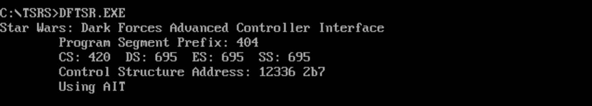
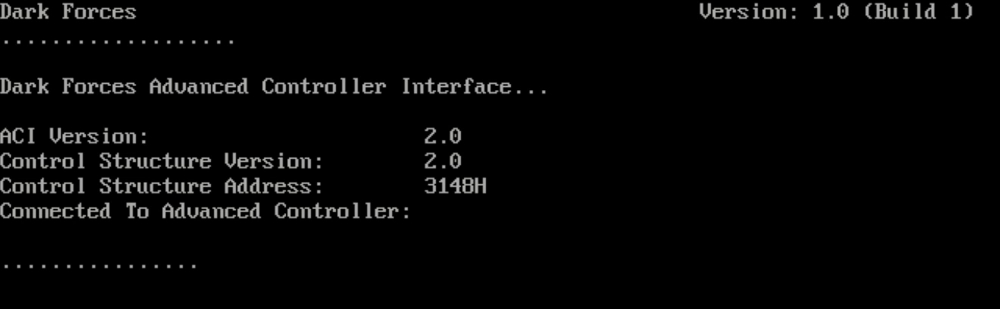

# Star Wars: Dark Forces - Advanced Controller Interface

## ¿Qué es esto?

En el juego de 1995, Star Wars: Dark Forces, muchas de las características
de prueba llegaron al .EXE de la versión final. Entre ellas una interfaz
llamada ACI o Advanced Controller Interface.

Aunque todavía no sé exactamente para qué sirven todos los datos del ACI,
lo que tengo claro es que ACI permite modificar parámetros clave del juego
en tiempo de ejecución.

## ¿Cómo puedo probarlo?

Es sencillo, puedes descargar el archivo .EXE de las releases o bien
clonate este repositorio y compilalo con Borland Turbo C 2.01.

Una vez tengas el archivo `DFTSR.EXE` lo siguiente que debes hacer es
abrir un DOSBox y ejecutar el archivo `DFTSR.EXE`.

> NOTA: DOSBox debe tener el Debugger habilitado.



Deberías ver un texto como este al ejecutarlo. Lo siguiente es establecer
el valor de `JEDIPATH`. Esta variable de entorno era la utilizada por el
equipo de desarrollo para tener su copia totalmente funcional y sin
necesitar verificar la copia de CD. Si tu juego está en `C:\DARK` entonces
`JEDIPATH` deberá apuntar a ese directorio.

```cmd
SET JEDIPATH=C:\DARK
```

Ahora ejecuta tu copia de **Star Wars: Dark Forces** utiizando estos parámetros:

```cmd
DARK.EXE -p -a12336
```

> NOTA: La dirección que sigue a al parámetro -a puede cambiar dependiendo
> de las cosas que hayas cargado en DOSBox antes de cargar DFTSR.

Al arrancar el juego deberías ver alguna información extra:



Si aparece esta información, el ACI está cargado y Star Wars: Dark Forces está
funcionando. Detén la ejecución del juego con Alt-Pause (o la que tengas configurada)
y una vez ahí puedes utilizar los siguientes comandos para modificar la memoria
del ACI:

```
SM segmento:offset valores
```

Todavía no tengo todos los valores localizados pero el valor la dirección `0x10` (desde
el inicio de `DFTSR.EXE`) al ser modificado hace que el jugador se ponga a hacer
"cosas raras". Si el valor en la dirección `0x24` es `0xFFFFFFFF` y se modifica el de `0x40`,
entonces el jugador rota. Que yo sepa hay hasta `0x1C0` registros que permiten modificar
parámetros y cosas del juego pero todavía no he conseguido averiguar cuál es su función
exacta.

Made with :heart: by [AzazelN28](https://github.com/AzazelN28)
